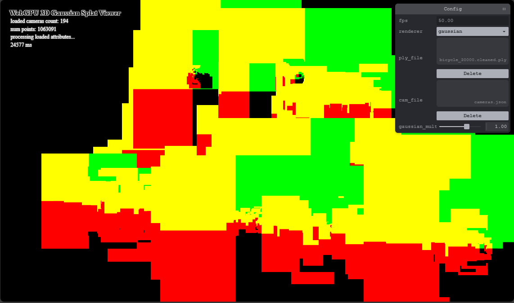

**Vismay Churiwala**

- [LinkedIn](https://www.linkedin.com/in/vismay-churiwala-8b0073190/) | [Website](https://vismaychuriwala.com/)
- Tested on:
  - Microsoft Edge 141.0.3537.99
  - Windows 11, AMD Ryzen 7 5800H @ 3.2GHz (8C/16T)
  - 32GB DDR4 RAM
  - NVIDIA GeForce RTX 3060 Laptop GPU (6GB GDDR6)

# WebGPU Gaussian Splat Viewer

| [](https://vismaychuriwala.github.io/WebGPU-Gaussian-Splat-Viewer/) |
| :----------------------------------------------------------------------------------------------: |
|                                      Bicycle scene, 1920×1080                                     |

## Table of Contents

- [Live Demo](#live-demo)
- [Project Overview](#project-overview)
- [How It Works](#how-it-works)
  - [Stage 1: Preprocessing Gaussians](#stage-1-preprocessing-gaussians)
  - [Stage 2: Depth Sorting](#stage-2-depth-sorting)
  - [Stage 3: Drawing Splats](#stage-3-drawing-splats)
- [Performance Analysis](#performance-analysis)
  - [Point Cloud vs Gaussian Renderer](#point-cloud-vs-gaussian-renderer)
  - [Workgroup Size Impact](#workgroup-size-impact)
  - [View Frustum Culling](#view-frustum-culling)
  - [Number of Gaussians](#number-of-gaussians)
- [Bloopers](#bloopers)
- [Credits](#credits)

## Live Demo

Try it yourself at [vismaychuriwala.github.io/WebGPU-Gaussian-Splat-Viewer](https://vismaychuriwala.github.io/WebGPU-Gaussian-Splat-Viewer/). You'll need to provide your own PLY scene file and camera configuration.

### Demo Video

https://github.com/user-attachments/assets/193cc355-4029-461c-aeb1-e8b5ea554344

## Project Overview

For this project, I implemented a browser-based gaussian splatting renderer using WebGPU. The goal was to recreate the rasterization pipeline from the [3D Gaussian Splatting paper](https://github.com/graphdeco-inria/gaussian-splatting)—taking pre-trained gaussian data and rendering it interactively. The training and reconstruction aspects weren't part of this assignment.

Rather than rendering traditional triangle meshes, gaussian splatting works with clouds of 3D Gaussians. Each gaussian is basically an ellipsoid with color information stored as spherical harmonics. During rendering, I transform these 3D shapes into 2D splats on the screen, then blend them together to create the final image. When done right, you get photorealistic results even though there's no explicit geometry.

I worked from the [original CUDA/C++ implementation](https://github.com/graphdeco-inria/diff-gaussian-rasterization) as a reference, but had to restructure everything for WebGPU. That codebase doesn't use graphics APIs at all—it's written for direct GPU control. Adapting it meant rethinking how data flows through compute shaders, sort passes, and the render pipeline while dealing with WebGPU's binding groups and buffer management.

Here's an example with the banana dataset from [OpenSplat](https://github.com/pierotofy/opensplat):

|  |
| :--------------------: |
|   Banana, 1920×1080    |

## How It Works

Every frame, I run three main stages:

1. **Compute shader preprocessing** - transform gaussians to 2D splats
2. **GPU radix sort** - order splats by depth
3. **Render pass** - draw and blend the splats

### Stage 1: Preprocessing Gaussians

The preprocessing compute shader is where most of the heavy lifting happens. Each thread handles one gaussian and decides whether it's visible, then computes all the data needed to render it as a 2D splat.

**Building the covariance matrices**: I start by reconstructing the 3D covariance matrix from the gaussian's rotation quaternion and scale vector. The rotation gives me an orthonormal basis (via `getR()`), the scale gives me the axis lengths (via `getS()`), and multiplying them produces the world-space covariance. Then I project this into screen space using the Jacobian of the projection transformation—this is how I figure out the 2D shape each gaussian will have on screen.

**Computing splat parameters**: For each visible gaussian, I calculate:
- The splat's center position in normalized device coordinates
- Its radius (I use 3 standard deviations, covering ~99.7% of the distribution)
- The conic matrix (inverse covariance) for evaluating the gaussian function per-pixel
- Color by evaluating spherical harmonics based on the view direction
- Opacity after sigmoid activation

**Culling invisible splats**: I implemented frustum culling to skip splats that won't appear on screen. I check if the depth is valid (between 0 and 1) and whether the center is roughly within NDC bounds. I actually use ±1.2 instead of ±1.0 because splats near the screen edge can still contribute pixels even when their centers are slightly outside. Culled splats never make it to the sort or render stages, which saves a ton of work.

I use atomic counters to track how many splats pass culling—this count becomes the instance count for the render pass.

#### Optimization: Half-Precision Packing

One thing I'm proud of is the memory optimization. The original gaussian data is stored as `f16` (half-precision floats), so I realized I could keep most of the splat data at that precision too without noticeable quality loss. Using `pack2x16float`, I stuff two halves into each `u32`.

The splat structure stores:
- Color as full `f32` (quality matters here)
- Conic matrix + opacity packed into 2 `u32` values
- Center position + radius packed into 2 `u32` values

This cuts memory usage dramatically and improves bandwidth, which makes both preprocessing and rendering faster:

|  |
| :--------------------------: |
| Memory layout comparison     |

### Stage 2: Depth Sorting

Transparency requires back-to-front rendering order, so I sort all visible splats by their view-space depth each frame. During preprocessing, I write each splat's depth and index into separate buffers, which then feed into a GPU radix sort.

The radix sort runs entirely on the GPU and reorders the splat indices based on their depth keys. I have to do this every frame because camera movement constantly changes the depth ordering.

### Stage 3: Drawing Splats

The render pass uses instanced indirect drawing—one quad per visible splat. The indirect buffer gets its instance count from the preprocessing stage's atomic counter.

**In the vertex shader**: I use the instance index to fetch the sorted splat data. Each splat gets expanded into a quad by unpacking its center and radius, then offsetting four corners appropriately. I pass the unpacked attributes (color, conic, opacity, center) to the fragment shader.

**In the fragment shader**: This is where I evaluate the actual gaussian. For each pixel, I compute the distance from the splat center, then use the conic matrix to calculate the gaussian's value at that point:

```wgsl
let power = -0.5 * (
    in.conic.x * d.x * d.x
  + in.conic.z * d.y * d.y
  - 2.0 * in.conic.y * d.x * d.y
);
```

The result is an exponential falloff that makes the splat fade smoothly toward its edges. I multiply by opacity and cap the contribution to avoid numerical issues, then let alpha blending do its job.

Since splats are already sorted, the blending naturally produces correct transparency and occlusion:

|  |  |
| :------------------------: | :----------------------------: |
| Quad boundaries visible    | Gaussian falloff applied       |

## Performance Analysis

All tests run at 1920×1080 on my system (specs above). Test scenes:
- **Bicycle** - 1,063,091 gaussians
- **Banana** - 464,017 gaussians
- **Bonsai** - 272,956 gaussians

### Point Cloud vs Gaussian Renderer

|  |  |
| :-----------------------------: | :---------------------------: |
|          Point cloud            |        Gaussian splats        |

| Configuration             | FPS  |
| :------------------------ | :--: |
| Point cloud               | 165+ |
| Gaussian                  | 51   |

> **Note**: FPS capped at 165 Hz (monitor refresh rate).

Point cloud uses native point primitives. Gaussian renderer draws instanced quads, evaluates per-pixel falloff, and requires full preprocessing pipeline (covariance computation, projection, sorting).

### Workgroup Size Impact

| Workgroup Size | FPS |
| :------------: | :-: |
| 64             | 40  |
| 128            | 73  |
| 256            | 51  |

128 threads performs best. Likely due to balance between memory coalescing and GPU occupancy. 256 may have reduced occupancy, 64 underutilizes memory bandwidth.

### View Frustum Culling


| Configuration        | FPS |
| :------------------- | :-: |
| No frustum culling   | 53  |
| With frustum culling | 97  |

1.8× speedup. Skips ~43% of gaussians outside view frustum. Reduces sorting overhead and preprocessing work (expensive covariance projection).

### Number of Gaussians

| Scene   | Gaussian Count | FPS |
| :------ | :------------: | :-: |
| Banana  | 464,017        | 117 |
| Bonsai  | 272,956        | 153 |
| Bicycle | 1,063,091      | 51  |

Performance scales roughly with gaussian count. Bicycle has 4× more gaussians than banana but <0.5× FPS due to increased memory bandwidth, larger buffer allocations, and radix sort overhead.


## Bloopers

|  |  |  |
| :----------------------------------: | :------------------------------------: | :--------------------------------------------: |
|    Multiple bugs at once             |     After fixing color computation     |        After fixing covariance sign            |

Left: Wrong SH indexing + covariance sign error + missing sigmoid on opacity. Middle: Fixed SH colors, still have covariance orientation bug causing spiky artifacts. Right: Fixed covariance, but opacity still in log-space (missing sigmoid).

## Credits

- [Vite](https://vite.dev/)
- [Tweakpane](https://tweakpane.github.io/docs/v3/)
- [stats.js](https://github.com/mrdoob/stats.js)
- [wgpu-matrix](https://github.com/greggman/wgpu-matrix)
- Shrek Shao from the Google WebGPU team
- The [differential gaussian rasterization](https://github.com/graphdeco-inria/diff-gaussian-rasterization) reference implementation
